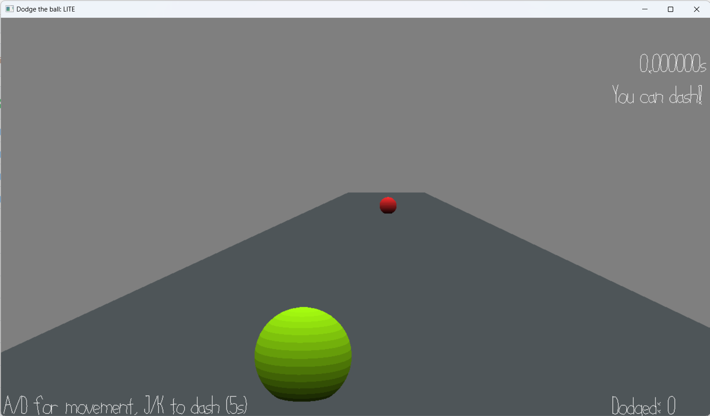

# Dodge the ball: Lite

Author: Sizhe Chen

Design: A simple game where you need to dodge the ball. 

Screen Shot:

How To Play:

Dodge the ball using A/D and dash with J/K. The ball will get faster! Press R to reset!

Note: Sorry for the simplicity, had a hard time dealing with blender.

This game was built with [NEST](NEST.md).
